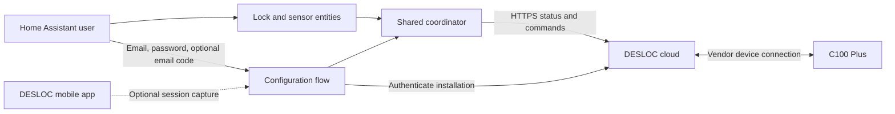

# DESLOC for Home Assistant

An **unofficial, experimental cloud integration** for the **DESLOC C100 Plus**
using the DESLOC mobile app. It provides lock/unlock controls, reported bolt
state, battery percentage, and Wi-Fi signal in Home Assistant.

This project is independent of DESLOC, Home Assistant, and HACS. It does not
provide local/offline or Bluetooth control. D110 Plus, B200, TTLock, and other
models have **not** been verified; device selection currently accepts C100 Plus.

## Status and limitations

The protocol and both command directions were captured from a real C100 Plus
using the iOS app with Bluetooth disabled. Device reads were reproduced with
[littledivy/mimic](https://github.com/littledivy/mimic) and the asynchronous client.
See [CHANGELOG.md](CHANGELOG.md) for physical validation from Home Assistant.
Synthetic tests do not establish physical operation.

**Version 0.2 adds email/password login and email verification for new HA
installations.** The account flow keeps a password-equivalent SHA-256 digest and
a stable installation ID. It renews rejected sessions automatically for reads;
physical commands are never resubmitted automatically. Captured-session setup
remains available, but those sessions require a new capture after revocation.

Account authentication is undergoing end-to-end validation in the 0.2 beta.
Other limitations:

- The observed device-list request covers up to 20 entries; pagination is untested.
- No access-code management, activity history, jam detection, or door-open sensor.
- Cloud telemetry can be cached. A cloud response does not prove the lock is
  currently reachable. The undocumented online-status enum is not interpreted.
- Undocumented endpoints may change; other regions and models need verification.

## Architecture

Normal polling runs once per minute. Each physical command is sent **once**, with
result polling and a requirement for a newer matching state report. Timeouts do
not cause automatic command retries. See [protocol details](docs/protocol.md).

## Requirements

- Home Assistant **2026.9.1 or newer**; 2026.9.1 is the tested baseline.
- C100 Plus already paired with DESLOC, with working cloud control.
- HTTPS access from Home Assistant to `appadmin.desloc.com`.
- Your DESLOC account email and password, with access to its verification emails.

## Installation

### HACS custom repository

This is **not currently listed in the default HACS catalog**.

1. In HACS, open the menu → **Custom repositories**.
2. Add `https://github.com/ha-homelab/ha-desloc`, type **Integration**.
3. Download **DESLOC (experimental)** and restart Home Assistant.
4. Open **Settings → Devices & services → Add integration → DESLOC**.

### Manual installation

Download a [release](https://github.com/ha-homelab/ha-desloc/releases) or clone this
repository. Copy only `custom_components/desloc/` into your Home Assistant
configuration's `custom_components/` directory. Restart and add the integration.
Capture files, certificates, and development tools are not runtime dependencies.

## Dashboard card

The optional [DESLOC Lock Card](https://github.com/ha-homelab/ha-desloc-card) is
distributed separately as a HACS **Dashboard** repository. It provides state,
battery/RSSI, and lock controls with mandatory unlock confirmation.

## Configuration

Choose **Sign in with email and password**. Enter the same credentials used by
the DESLOC app. If DESLOC requires verification for the new installation, enter
the code sent to your email, then select your C100 Plus from the account's devices.

To move an existing entry from a captured session to account login, open the
entry menu under **Settings → Devices & services → DESLOC → Reconfigure**.
The existing lock must be present in the new account; entity IDs are retained.

HA stores a password-equivalent digest, not the plaintext password or one-time
code. Protect HA configuration and backups as credentials. Password changes,
CAPTCHA, and security checks can require interactive reauthentication. The host
clock must be synchronized.

For the alternative **Use a captured app session** option, follow
[the capture guide](docs/authentication.md). Its token belongs to the phone's
installation and can be revoked when you sign out of the app.

## Entities

- **Lock**: lock/unlock, reported state, and transitions during commands.
- **Battery**: reported percentage.
- **Wi-Fi signal**: RSSI in dBm, a diagnostic entity.
- **Door state code** and **Online status code**: raw diagnostics, disabled by default.

Observed bolt codes are `1` = unlocked and `2` = locked. Other codes are unknown.
Following an uncertain command, old telemetry is not treated as confirmation.
Check the physical lock before deciding whether to issue another command.
Loss of cloud access or removal of the device makes entities unavailable.

## Documentation and contributions

- [Session capture and cleanup](docs/authentication.md)
- [Protocol, command sequence, and state machine](docs/protocol.md)
- [Troubleshooting](docs/troubleshooting.md)
- [Development and tests](docs/development.md)
- [HACS and Core publication](docs/publishing.md)
- [Contributing](CONTRIBUTING.md) and [security](SECURITY.md)

Never attach raw traffic, tokens, CA keys, account data, serial numbers, or
Home Assistant config-entry contents to public issues. Use synthetic fixtures.

## Credits and license

Capture and protocol reproduction used [littledivy/mimic](https://github.com/littledivy/mimic),
pinned to `8cf998ac0b365806d8e522d34107cc504ecaa345`. The runtime uses Home
Assistant's shared `aiohttp` session; no proxy, mimic, or open app is required
after setup. Source and original project artwork are [MIT-licensed](LICENSE).
DESLOC names and trademarks belong to their respective owners.
