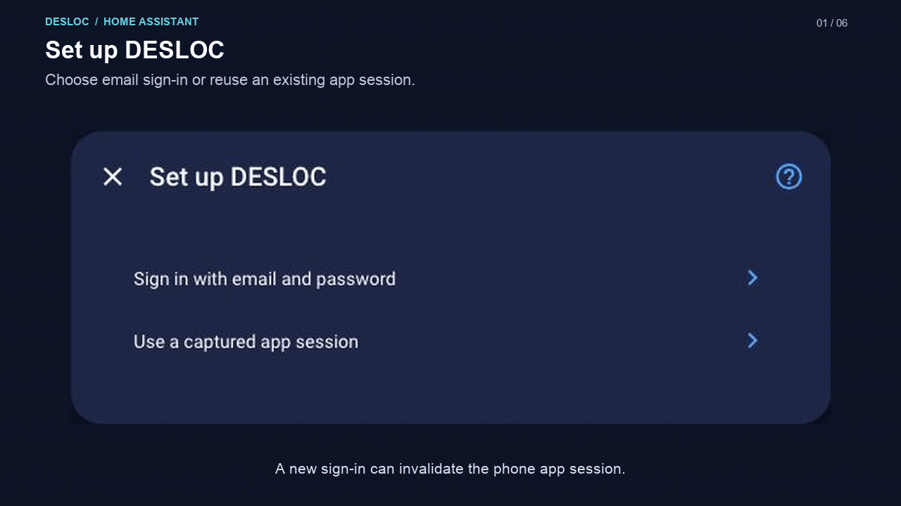
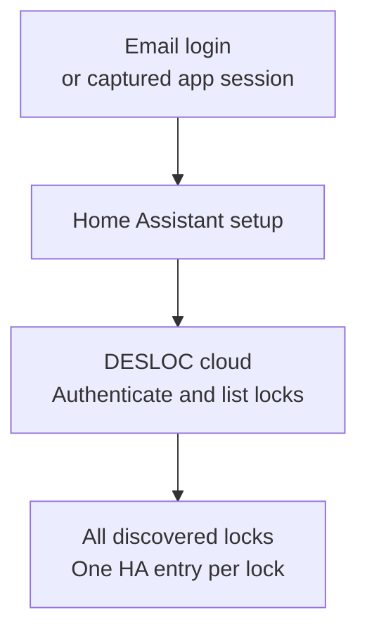
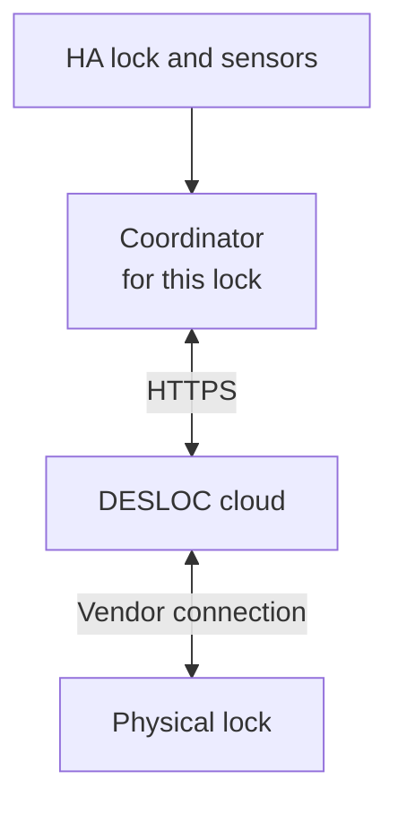

# DESLOC for Home Assistant

An **unofficial, experimental cloud integration** for locks linked to the
**DESLOC mobile app**. It automatically adds every lock returned by the account
during setup. **C100 Plus is maintainer-tested; D110 Plus is community-reported
working.** It provides lock/unlock controls, reported bolt state, battery
percentage, and Wi-Fi signal in Home Assistant.

This project is independent of DESLOC, Home Assistant, and HACS. It does not
provide local/offline or Bluetooth control. A D110 Plus owner
[reported that it works perfectly](https://github.com/home-assistant/feature-requests/discussions/2138#discussioncomment-18702050).
That report does not list individual features tested, including PIN creation;
see [model compatibility](docs/compatibility.md) for the evidence and scope.
Models without maintainer validation still carry an **experimental** runtime
label. Discovery alone does not establish compatibility. TTLock/Tuya accounts
are not supported by this integration.

The silent 30-second animation loops through real Home Assistant screenshots,
including the optional [DESLOC Lock Card](https://github.com/ha-homelab/ha-desloc-card).
See the [screenshot walkthrough](docs/screenshots.md) for authentication,
discovered devices, and the PIN user form.

[Watch the 30-second interface overview](docs/media/desloc-overview.mp4)
(silent, English captions) · [Video transcript](docs/video.md)

## Status and limitations

The protocol and both command directions were captured from a real C100 Plus
using the iOS app with Bluetooth disabled. Device reads were reproduced with
[littledivy/mimic](https://github.com/littledivy/mimic) and the asynchronous client.
See [CHANGELOG.md](CHANGELOG.md) for physical validation from Home Assistant.
Synthetic tests do not establish physical operation.

**Update 0.2.0 installations to 0.2.1.** Automatic login in 0.2.0 was observed to
conflict with the phone app and repeatedly sign it out. Version 0.2.1 saves and
reuses the authenticated session token and stops on rejection; it never signs
in automatically after a rejected request. A distinct installation ID did not
prevent the observed session conflict.

Email/password login and email-code verification work, but a new login can
invalidate the phone app's session. To use the same account in HA and the app,
import the current app session with the [capture guide](docs/authentication.md).
Signing out or another login can revoke that token. Natural expiry is unmeasured.
Other limitations:

- Device discovery reads 20-entry cursor pages from the app's default group
  (`groupId: 0`). The cursor boundary was checked on a real one-lock account;
  multiple populated pages and accounts spanning multiple groups/homes still
  need community verification. A repeated cursor or 100-page limit is reported
  as an error rather than silently accepting a truncated list.
- Version 0.3.0 adds regular permanent PIN users. Creation through the HA form
  and use at the physical keypad were confirmed on C100 Plus; modification,
  deletion, and schedules are unsupported.
- No activity history, jam detection, or door-open sensor.
- Cloud telemetry can be cached. A cloud response does not prove the lock is
  currently reachable. The undocumented online-status enum is not interpreted.
- Undocumented endpoints may change; other regions and models need verification.

## Architecture

Setup authenticates with DESLOC and adds every returned lock:

After setup, each lock has its own coordinator:

Normal polling runs once per minute per configured lock. Each physical command is sent **once**, with
result polling and a requirement for a newer matching state report. Timeouts do
not cause automatic command retries. See [protocol details](docs/protocol.md).

## Requirements

- Home Assistant **2026.9.1 or newer**; 2026.9.1 is the tested baseline.
- Locks already paired with the DESLOC app, with working cloud control.
  C100 Plus is maintainer-tested and D110 Plus has a community success report;
  see [model compatibility](docs/compatibility.md) for details.
- HTTPS access from Home Assistant to `appadmin.desloc.com`.
- A captured app session, or your DESLOC account email/password and verification email access.

## Installation

### HACS custom repository

**Not yet published in the default HACS catalog.** Install it as a custom
repository using the steps below. A submission or an open review request does
not mean HACS has accepted the project. HACS is optional; manual installation
works without it.

1. If needed, [install and configure HACS](https://www.hacs.xyz/docs/use/download/download/).
2. Open **HACS → ⋮ → Custom repositories**.
3. Enter `https://github.com/ha-homelab/ha-desloc` and choose **Integration**.
4. Find **DESLOC (experimental)** in HACS and choose **Download**. Select the
   latest numbered release without a `b`/`rc` suffix, rather than `main` or a
   prerelease. Leave beta versions disabled for normal use.
5. Restart Home Assistant, then open **Settings → Devices & services → Add
   integration → DESLOC**.
6. Complete [configuration](#configuration) below. Every returned lock is added
   automatically; there is no model filter or device chooser.

For updates, download the newer stable version from HACS and restart HA. The
existing entry and entity IDs are retained; you do not need to add it again.

### Manual installation

1. Open [Releases](https://github.com/ha-homelab/ha-desloc/releases/latest) and
   download the latest stable release's **Source code (zip)**. Extract it on your
   computer.
2. Locate your HA configuration directory, the one containing
   `configuration.yaml`. On HA OS this is `/config`; for Container installations
   it is the host directory mounted at `/config`.
3. Create `custom_components` there if needed. Copy the extracted
   `custom_components/desloc` directory into it, including all its files and
   subdirectories. The final file must be
   `/config/custom_components/desloc/manifest.json`, without an extra repository
   or `custom_components` directory in between.
4. Restart Home Assistant. Reload your browser if DESLOC does not appear in the
   integration picker.
5. Open **Settings → Devices & services → Add integration → DESLOC**, complete
   the authentication form below. All returned locks are added automatically.

To update a manual installation, back up your configuration, replace only the
`custom_components/desloc` directory with the stable release's copy, and restart
HA. Capture files, certificates, Node.js, mimic, and development tools are not
runtime dependencies. Do not copy this entire development repository into HA.

## Dashboard card

The optional [DESLOC Lock Card](https://github.com/ha-homelab/ha-desloc-card) is
distributed separately as a HACS **Dashboard** repository. It provides state,
battery/RSSI, and lock controls with mandatory unlock confirmation.

## Configuration

For the same account as your phone, choose **Use a captured app session** and
follow [the capture guide](docs/authentication.md). This reuses the app's token
without signing in again. All returned locks are added automatically, with a
separate integration entry and entities for each lock.

Alternatively choose **Sign in with email and password**. Enter your DESLOC
credentials and any requested email code. The integration adds all returned locks. This new login
can invalidate another session on the same account, including the phone app.

To change the authentication method of an existing entry, open its three-dot
menu under **Settings → Devices & services → DESLOC → Reconfigure**.
The existing lock must be present in the account; existing entry/entity IDs are
retained. The same validated session is applied to the other returned locks, and
new ones are added without another login. Disabled entries remain disabled.

To discover a lock paired after initial setup, run **Reconfigure** on one DESLOC
entry using the current app session (or interactive account login). Discovery
runs during setup/reconfiguration; regular state polling does not create new
entries. Setup and discovery never send unlock, lock, or PIN commands.

HA stores the resulting session token and installation ID. New entries do not
retain the password, its digest, or the one-time code. Protect HA configuration
and backups as credentials. Rejected sessions require interactive
reauthentication; HA never retries login in the background. Existing 0.2.0
account entries must reauthenticate or import the app session during upgrade.

## Entities

- **Lock**: lock/unlock, reported state, and transitions during commands.
- **Battery**: reported percentage.
- **Wi-Fi signal**: RSSI in dBm, a diagnostic entity.
- **Door state code** and **Online status code**: raw diagnostics, disabled by default.

Observed bolt codes are `1` = unlocked and `2` = locked. Other codes are unknown.
Following an uncertain command, old telemetry is not treated as confirmation.
Check the physical lock before deciding whether to issue another command.
Loss of cloud access or removal of the device makes entities unavailable.

## PIN users

In version 0.3.0 or newer, open **Settings → Devices & services → DESLOC** and click
**Configure** (the gear icon beside the entry for the intended lock). The form is titled
**Add a permanent PIN user**. Enter a new, unique **User name**, a **New PIN** of
6–8 digits, and **Repeat PIN**, then choose **Submit**. This creates a regular
user with permanent access to the physical lock. The
integration waits for command completion and checks the installed PIN record;
it does not save the PIN in HA. The PIN is added only to that entry's lock. This
workflow is physically verified on C100 Plus; other models are experimental.
See [PIN setup and failure handling](docs/pin-users.md).

## Community model testing

**D110 Plus has a community success report.** On October 1, 2026,
[Marty-McFly73 reported successful use](https://github.com/home-assistant/feature-requests/discussions/2138#discussioncomment-18702050)
with their D110 Plus. The report is general; individual feature results and
software/firmware versions were not provided. The
[compatibility notes](docs/compatibility.md) distinguish this report from the
feature-by-feature C100 Plus validation.

Every lock entity exposes `model_validation: tested` for C100 Plus and
`model_validation: experimental` for other model names. These labels record
maintainer validation, not certification by the vendor. D110 Plus retains its
experimental runtime label while its community report is recorded in the docs.
Unknown state codes remain
unknown, and a command must receive a fresh matching report to be confirmed.

For another model, report which features work: discovery, reported bolt state,
battery/RSSI, lock/unlock, and PIN creation. Include model, firmware/app versions,
HA version, and a description of any failure. Under **Settings → Devices &
services → DESLOC**, the lock entry's menu offers **Download diagnostics**. The
integration exports an allowlist of model/firmware, availability, and telemetry;
it excludes credentials, PINs, names, MACs, device IDs, and raw responses. Review
the downloaded file before posting it.

We will fix models where this API can support them and document or exclude
models whose protocol is incompatible. Please do not assume an untested model
works solely because it appears in HA.

## Documentation and contributions

- [Model compatibility and community reports](docs/compatibility.md)
- [Screenshots and setup walkthrough](docs/screenshots.md)
- [Session capture and cleanup](docs/authentication.md)
- [Protocol, command sequence, and state machine](docs/protocol.md)
- [Create a permanent PIN user](docs/pin-users.md)
- [Troubleshooting](docs/troubleshooting.md)
- [Development and tests](docs/development.md)
- [HACS and Core publication](docs/publishing.md)
- [Contributing](CONTRIBUTING.md) and [security](SECURITY.md)

Never attach raw traffic, tokens, CA keys, account data, serial numbers, or
Home Assistant config-entry contents to public issues. Use synthetic fixtures.

## Credits and license

Capture and protocol reproduction used [littledivy/mimic](https://github.com/littledivy/mimic),
pinned to `8cf998ac0b365806d8e522d34107cc504ecaa345`. The runtime uses Home
Assistant's shared `aiohttp` session; no proxy, mimic, or open app is required
after setup. Source and original project artwork are [MIT-licensed](LICENSE).
DESLOC names and trademarks belong to their respective owners.
