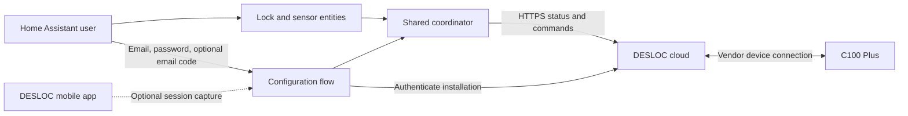

# DESLOC for Home Assistant

An **unofficial, experimental cloud integration** for the **DESLOC C100 Plus**
using the DESLOC mobile app. It provides lock/unlock controls, reported bolt
state, battery percentage, and Wi-Fi signal in Home Assistant.

This project is independent of DESLOC, Home Assistant, and HACS. It does not
provide local/offline or Bluetooth control. D110 Plus, B200, TTLock, and other
models have **not** been verified; device selection currently accepts C100 Plus.

## Status and limitations

The protocol and both command directions were captured from a real C100 Plus
using the iOS app with Bluetooth disabled. Device reads were reproduced with
[littledivy/mimic](https://github.com/littledivy/mimic) and the asynchronous client.
See [CHANGELOG.md](CHANGELOG.md) for physical validation from Home Assistant.
Synthetic tests do not establish physical operation.

**Update 0.2.0 installations to 0.2.1.** Automatic login in 0.2.0 was observed to
conflict with the phone app and repeatedly sign it out. Version 0.2.1 saves and
reuses the authenticated session token and stops on rejection; it never signs
in automatically after a rejected request. A distinct installation ID did not
prevent the observed session conflict.

Email/password login and email-code verification work, but a new login can
invalidate the phone app's session. To use the same account in HA and the app,
import the current app session with the [capture guide](docs/authentication.md).
Signing out or another login can revoke that token. Natural expiry is unmeasured.
Other limitations:

- The observed device-list request covers up to 20 entries; pagination is untested.
- The 0.3 beta adds creation of regular permanent PIN users. Live HA-form
  validation is in progress; modification, deletion, and schedules are unsupported.
- No activity history, jam detection, or door-open sensor.
- Cloud telemetry can be cached. A cloud response does not prove the lock is
  currently reachable. The undocumented online-status enum is not interpreted.
- Undocumented endpoints may change; other regions and models need verification.

## Architecture

Normal polling runs once per minute. Each physical command is sent **once**, with
result polling and a requirement for a newer matching state report. Timeouts do
not cause automatic command retries. See [protocol details](docs/protocol.md).

## Requirements

- Home Assistant **2026.9.1 or newer**; 2026.9.1 is the tested baseline.
- C100 Plus already paired with DESLOC, with working cloud control.
- HTTPS access from Home Assistant to `appadmin.desloc.com`.
- A captured app session, or your DESLOC account email/password and verification email access.

## Installation

### HACS custom repository

**Not yet published in the default HACS catalog.** Install it as a custom
repository using the steps below. A submission or an open review request does
not mean HACS has accepted the project. HACS is optional; manual installation
works without it.

1. If needed, [install and configure HACS](https://www.hacs.xyz/docs/use/download/download/).
2. Open **HACS → ⋮ → Custom repositories**.
3. Enter `https://github.com/ha-homelab/ha-desloc` and choose **Integration**.
4. Find **DESLOC (experimental)** in HACS and choose **Download**. Select the
   latest numbered release without a `b`/`rc` suffix, rather than `main` or a
   prerelease. Leave beta versions disabled for normal use.
5. Restart Home Assistant, then open **Settings → Devices & services → Add
   integration → DESLOC**.
6. Complete [configuration](#configuration) below and select your C100 Plus.

For updates, download the newer stable version from HACS and restart HA. The
existing entry and entity IDs are retained; you do not need to add it again.

### Manual installation

1. Open [Releases](https://github.com/ha-homelab/ha-desloc/releases/latest) and
   download the latest stable release's **Source code (zip)**. Extract it on your
   computer.
2. Locate your HA configuration directory, the one containing
   `configuration.yaml`. On HA OS this is `/config`; for Container installations
   it is the host directory mounted at `/config`.
3. Create `custom_components` there if needed. Copy the extracted
   `custom_components/desloc` directory into it, including all its files and
   subdirectories. The final file must be
   `/config/custom_components/desloc/manifest.json`, without an extra repository
   or `custom_components` directory in between.
4. Restart Home Assistant. Reload your browser if DESLOC does not appear in the
   integration picker.
5. Open **Settings → Devices & services → Add integration → DESLOC**, complete
   the authentication form below, and select your C100 Plus.

To update a manual installation, back up your configuration, replace only the
`custom_components/desloc` directory with the stable release's copy, and restart
HA. Capture files, certificates, Node.js, mimic, and development tools are not
runtime dependencies. Do not copy this entire development repository into HA.

## Dashboard card

The optional [DESLOC Lock Card](https://github.com/ha-homelab/ha-desloc-card) is
distributed separately as a HACS **Dashboard** repository. It provides state,
battery/RSSI, and lock controls with mandatory unlock confirmation.

## Configuration

For the same account as your phone, choose **Use a captured app session** and
follow [the capture guide](docs/authentication.md). This reuses the app's token
without signing in again. Select your C100 Plus from the returned devices.

Alternatively choose **Sign in with email and password**. Enter your DESLOC
credentials and any requested email code, then select your lock. This new login
can invalidate another session on the same account, including the phone app.

To change the authentication method of an existing entry, open its three-dot
menu under **Settings → Devices & services → DESLOC → Reconfigure**.
The existing lock must be present in the new account; entity IDs are retained.

HA stores the resulting session token and installation ID. New entries do not
retain the password, its digest, or the one-time code. Protect HA configuration
and backups as credentials. Rejected sessions require interactive
reauthentication; HA never retries login in the background. Existing 0.2.0
account entries must reauthenticate or import the app session during upgrade.

## Entities

- **Lock**: lock/unlock, reported state, and transitions during commands.
- **Battery**: reported percentage.
- **Wi-Fi signal**: RSSI in dBm, a diagnostic entity.
- **Door state code** and **Online status code**: raw diagnostics, disabled by default.

Observed bolt codes are `1` = unlocked and `2` = locked. Other codes are unknown.
Following an uncertain command, old telemetry is not treated as confirmation.
Check the physical lock before deciding whether to issue another command.
Loss of cloud access or removal of the device makes entities unavailable.

## PIN users

In the 0.3 beta, open **Settings → Devices & services → DESLOC** and click
**Configure** (the gear icon beside the C100 Plus entry). The form is titled
**Add a permanent PIN user**. Enter a new, unique **User name**, a **New PIN** of
6–8 digits, and **Repeat PIN**, then choose **Submit**. This creates a regular
user with permanent access to the physical lock. The
integration waits for command completion and checks the installed PIN record;
it does not save the PIN in HA. See [PIN setup and failure handling](docs/pin-users.md).

## Documentation and contributions

- [Session capture and cleanup](docs/authentication.md)
- [Protocol, command sequence, and state machine](docs/protocol.md)
- [Create a permanent PIN user](docs/pin-users.md)
- [Troubleshooting](docs/troubleshooting.md)
- [Development and tests](docs/development.md)
- [HACS and Core publication](docs/publishing.md)
- [Contributing](CONTRIBUTING.md) and [security](SECURITY.md)

Never attach raw traffic, tokens, CA keys, account data, serial numbers, or
Home Assistant config-entry contents to public issues. Use synthetic fixtures.

## Credits and license

Capture and protocol reproduction used [littledivy/mimic](https://github.com/littledivy/mimic),
pinned to `8cf998ac0b365806d8e522d34107cc504ecaa345`. The runtime uses Home
Assistant's shared `aiohttp` session; no proxy, mimic, or open app is required
after setup. Source and original project artwork are [MIT-licensed](LICENSE).
DESLOC names and trademarks belong to their respective owners.
