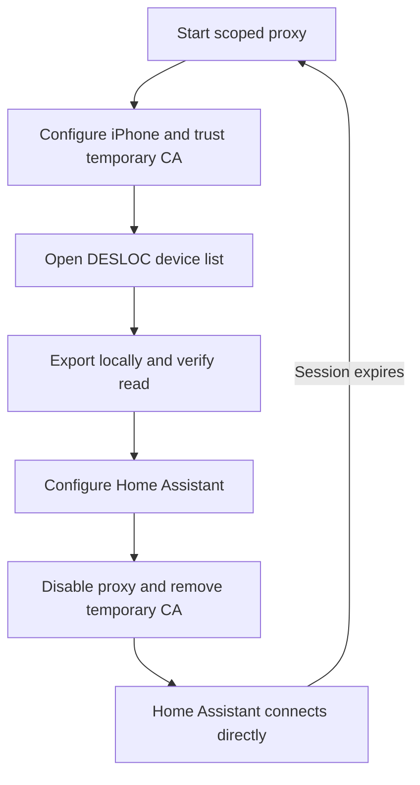

# Capture your DESLOC session

Use your own account and device. Captures contain credentials that can control
the lock; keep `.private/` local and out of public reports.

## Prepare the computer

Use a computer on the same LAN as the iPhone:

```sh
git clone https://github.com/ha-homelab/ha-desloc.git
cd ha-desloc
uv venv --python 3.13 .venv
git clone https://github.com/littledivy/mimic.git tools/mimic
git -C tools/mimic checkout 8cf998ac0b365806d8e522d34107cc504ecaa345
uv pip install --python .venv/bin/python -e './tools/mimic[capture]'
.venv/bin/python scripts/capture.py start
```

The command prints the proxy address and port. To override automatic address
selection, stop the unused proxy and start it with environment variable
`DESLOC_CAPTURE_HOST=<YOUR_COMPUTER_LAN_IP>`. Proxy port: 8080. The authenticated
dashboard listens on loopback only, port 18081.

Only the three observed DESLOC HTTPS hosts are decrypted. Other HTTPS traffic
passes through. Exported traffic is restricted to DESLOC domains.

## Prepare the iPhone

1. Wi-Fi settings → your network → Configure Proxy → Manual: use the printed
   computer address and port 8080, authentication off.
2. Visit **`http://mitm.it`** using plain HTTP and download the Apple profile.
   HTTPS bypasses interception and can misleadingly report that the proxy is unused.
3. Install the profile under Settings → General → VPN & Device Management.
4. Enable full trust under Settings → General → About → Certificate Trust Settings.
   Installing the profile alone is insufficient.
5. Temporarily disable Bluetooth, fully close DESLOC, reopen it, and view the
   device list. A physical lock command is not required to extract the session.

If the device list disappears, check certificate trust. Disable the Wi-Fi proxy
to restore direct access. Do not reset or re-pair the lock for a proxy problem.

If `mitm.it` fails, run the optional public-certificate helper in another terminal:

```sh
.venv/bin/python scripts/certificate_server.py
```

Visit `http://<YOUR_COMPUTER_LAN_IP>:18080/desloc.mobileconfig`. Only the public CA
profile is served; private keys and arbitrary files are inaccessible. Stop this
foreground helper with Ctrl-C after use.

## Export and configure

```sh
.venv/bin/python scripts/capture.py export
.venv/bin/python scripts/probe_devices.py
```

The probe replays only the observed device-list request through mimic. It writes
`.private/ha-session.json` with mode 0600 and prints telemetry without tokens.
Enter its fields in Home Assistant's DESLOC setup form.



## Cleanup

Set the iPhone Wi-Fi proxy to **Off first**, then run
`.venv/bin/python scripts/capture.py stop`. Stop any separately started certificate
helper. Remove the temporary mitmproxy profile and certificate trust, and restore
Bluetooth as desired. The app, proxy, and computer need not remain open.

Never publish the session file, raw HAR/mitmproxy traffic, or CA material. When
the session expires, capture a new one and use Home Assistant's reauthentication
flow, which checks that the same lock is present.
