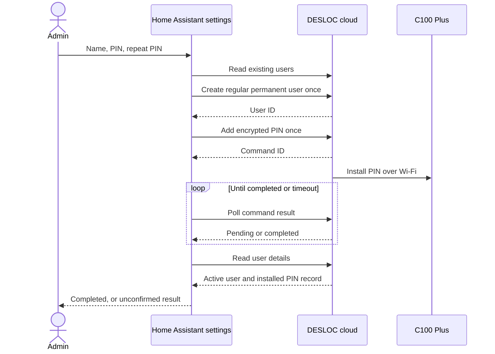

# Create a permanent PIN user

Available in the 0.3 beta for C100 Plus. The protocol was captured from a real
Wi-Fi operation in the DESLOC iOS app, with Bluetooth disabled. End-to-end
creation from the HA form still needs live validation.

## Home Assistant form

1. Open **Settings → Devices & services → DESLOC**.
2. Choose **Configure** for the lock entry.
3. Enter a unique user name of 1–24 characters, a PIN of 6–8 digits, and repeat
   the PIN. Submitting the form creates access to the lock.
4. Wait for completion. The integration checks the command result and the
   resulting user/PIN record. Test the PIN at the physical keypad.

The form creates a new regular, permanent user. It does not grant app-account
access or owner privileges. The same name is used for the user and PIN label.
Existing users with a matching name are rejected before a write. Other user
types, schedules, modification, and deletion are not implemented.

**Configure** opens this management form. **Reconfigure** changes the integration's
authentication. The integration must be loaded and connected before adding a PIN.

The PIN is handled only for the current request. It is not saved in integration
options, entity states, attributes, or configuration entries, and no HA service
with a PIN payload is registered. This form uses HA's administrator-only options
flow. HA and DESLOC still receive the input over their authenticated connections.

## Confirmation and failures

Creating the user and installing its PIN are separate writes. If the second
step fails, the new user may exist without a working PIN. If a request times out,
it may still have reached the server or lock. Check the DESLOC app before
starting another attempt. The integration never retries writes, changes an
existing user, or deletes a partially created user automatically.

The operation has a 60-second deadline and cannot overlap a lock/unlock command
for the same entry. Read-only state polling continues normally. A successful
cloud result establishes the reported installation, not physical keypad testing.

## Observed requests

- `POST /api/access/user/list`: `deviceId` as a string.
- `POST /api/access/user/v1/add`: `deviceId`, `userName`, `accessType: 1`.
- `POST /api/access/key/remote/addPwd`: `accessId`, `keyName`, encrypted `password`.
- `POST /api/device/fecommand/result/<commandId>`: pending `2206`, complete `200`.
- `POST /api/access/user/detail`: `id` as a string.

The PIN uses the same AES-CBC/PKCS#7 wire encoding described in
[authentication](protocol.md#authentication), applied directly to the PIN text,
without the account-password digest or timestamp. This encoding is inside TLS;
it is not a secure format for storing PINs. The observed final record has
`accessType: 1`, `status: 1`, `updateFlag: 0`, and a key with `keyType: 1` and
`updateFlag: 0`. Other values are not treated as successful installation.
