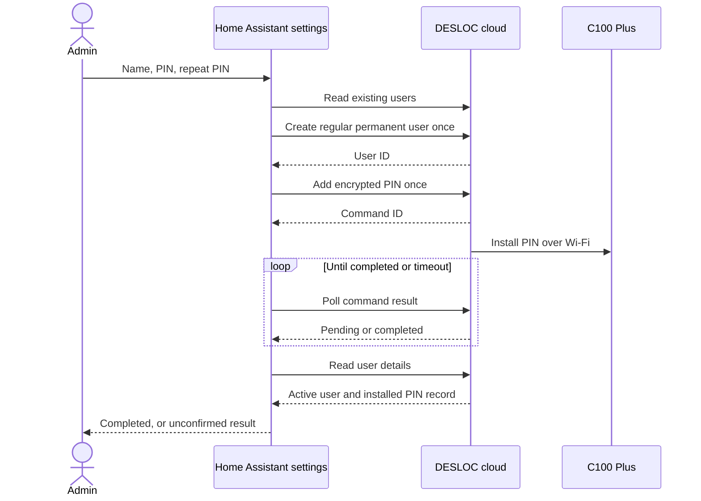

# Create a permanent PIN user

Available in stable version 0.3.0 or newer; physically tested on C100 Plus.
Other discovered DESLOC models use the same workflow experimentally. The protocol was
captured from a real Wi-Fi operation in the DESLOC iOS app with Bluetooth
disabled. Creation through the HA form and the resulting PIN at the physical
keypad were confirmed by the lock owner on Home Assistant 2026.9.1.

## Home Assistant form

1. Open **Settings → Devices & services → DESLOC**.
2. Find the entry for the intended lock and click **Configure** (its gear icon). This opens
   **Add a permanent PIN user**.
3. Fill in **User name** (a new name of 1–24 characters), **New PIN** (6–8 digits),
   and **Repeat PIN**, then choose **Submit**. Use your own PIN and do not post it
   in an issue or chat. Submitting the form creates access to the lock.
4. Wait for completion. The integration checks the command result and the
   resulting user/PIN record. Test the PIN at the physical keypad and relock
   the door after testing. You can also check the new user in the DESLOC app.

The form creates a new regular, permanent user on that entry's lock only; it
does not propagate the PIN to other locks in the account. It does not grant app-account
access or owner privileges. The same name is used for the user and PIN label.
Existing users with a matching name are rejected before a write. Other user
types, schedules, modification, and deletion are not implemented.

**Configure** opens this management form. **Reconfigure** changes the integration's
authentication. The integration must be loaded and connected before adding a PIN.

The PIN is handled only for the current request. It is not saved in integration
options, entity states, attributes, or configuration entries, and no HA service
with a PIN payload is registered. This form uses HA's administrator-only options
flow. HA and DESLOC still receive the input over their authenticated connections.

## Confirmation and failures

Creating the user and installing its PIN are separate writes. If the second
step fails, the new user may exist without a working PIN. If a request times out,
it may still have reached the server or lock. Check the DESLOC app before
starting another attempt. The integration never retries writes, changes an
existing user, or deletes a partially created user automatically.

The form distinguishes a busy lock, unavailable status, or a failed read before
any write from an uncertain write result. When a matching user already exists,
HA reads that user's details without changing them. If the installed PIN record
with the user's label is not confirmed, the form directs you to inspect and
manage that user in the DESLOC app. This can help after a partially completed
attempt, but it does not prove that HA created the existing user. A confirmed
record also does not compare the PIN you entered with the existing PIN. Finish
or remove an incomplete user in the DESLOC app before starting a new HA attempt;
HA never attaches a new PIN to an existing user automatically.

The operation has a 60-second deadline and cannot overlap a lock/unlock command
for the same entry. Read-only state polling continues normally. A successful
cloud result establishes the reported installation, not physical keypad testing.

## Observed requests

- `POST /api/access/user/list`: `deviceId` as a string.
- `POST /api/access/user/v1/add`: `deviceId`, `userName`, `accessType: 1`.
- `POST /api/access/key/remote/addPwd`: `accessId`, `keyName`, encrypted `password`.
- `POST /api/device/fecommand/result/<commandId>`: pending `2206`, complete `200`.
- `POST /api/access/user/detail`: `id` as a string.

The PIN uses the same AES-CBC/PKCS#7 wire encoding described in
[authentication](protocol.md#authentication), applied directly to the PIN text,
without the account-password digest or timestamp. This encoding is inside TLS;
it is not a secure format for storing PINs. The observed final record has
`accessType: 1`, `status: 1`, `updateFlag: 0`, and a key with `keyType: 1` and
`updateFlag: 0`. Other values are not treated as successful installation.
