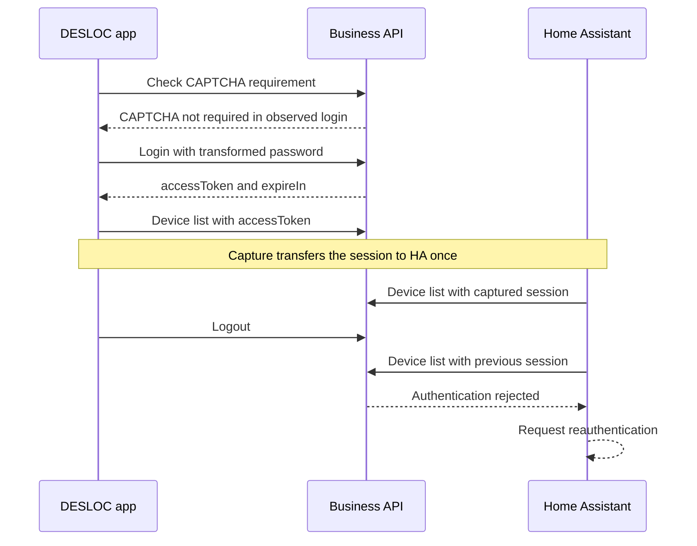
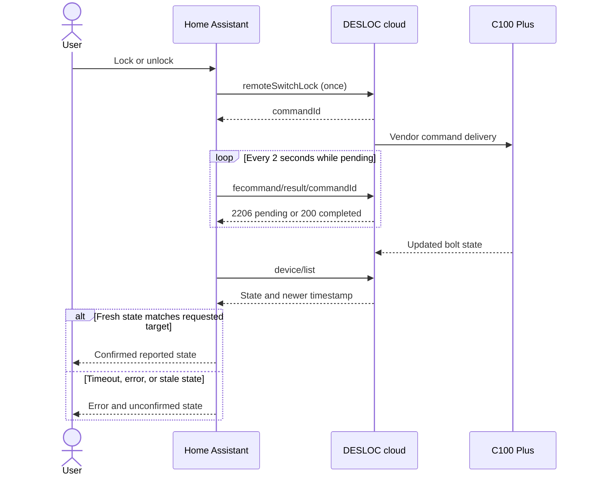
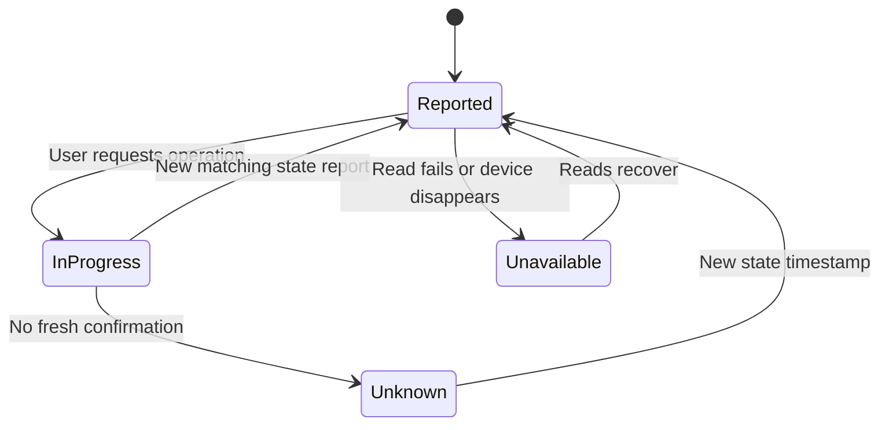

# Observed protocol

Observed on C100 Plus and DESLOC iOS 1.2.1. Examples use synthetic IDs. This is
not an official API specification.

## Authentication

The business API `https://appadmin.desloc.com` requires `authorization`,
`deviceid`, `appversion`, and `systype` headers. Removing any one caused rejection.
The opaque authorization token is sent verbatim.

A logout/login capture from iOS 1.2.1 established the following sequence:

1. `POST /api/user/login/isNeedCaptcha` with `userName` checks whether CAPTCHA is
   required. The observed successful response had `data.isNeedCaptcha: false`.
2. `POST /api/user/login` sends `userName`, `password`, and `childAgreement: true`.
   In this capture, `password` was a 160-character hexadecimal value, not the
   password as typed. Its transformation has not been established.
3. Successful login returns `data.accessToken`, `data.expireIn`, and `data.userId`.
   That access token exactly matched the subsequent business API authorization.
   The reported `expireIn` was `5184000`; units and actual expiry behavior have
   not been independently verified.
4. `POST /api/user/logout` revoked the session previously used by Home Assistant.
   Supplying the newly captured session through HA reauthentication restored
   device reads without changing the selected lock or sending a lock command.

A single replay of the captured login body with a newly generated app device ID
and the four minimal headers was rejected with business status `1103`. This does
not establish whether the cause was the device ID, omitted headers, freshness,
or another requirement. Replaying a saved login body is not a verified login or
renewal mechanism. The integration still supports captured sessions only.

The app separately posts to `https://iot.desloc.com/oauth/token` with a URL-encoded
form containing `appId` and `biz_token`. That returns an access token, refresh
token, and expiry. Neither the access token nor the form's business token matched
the business API authorization in the captured session. This exchange does not
establish a refresh mechanism for this integration.

Signed requests to `xsgateway.desloc.com` were also observed; this integration
does not require that interface or reproduce its signatures.

## Status

`POST /api/device/list` uses `{"groupId":0,"size":20}`. Success has `status: 200`,
`success: true`, and a device list in `data`. Fields used:

- `id`: numeric cloud identity; commands send its string representation.
- `mac`: Bluetooth MAC, used for stable config-entry identity.
- `deviceName`, `model`, `firmwareVersion`: metadata.
- `doorState`: 1 unlocked, 2 locked; other values remain unknown.
- `doorStateUpdateTime`: reported state timestamp in milliseconds.
- `batteryValue`: percentage, accepted only within 0–100.
- `networkSignal`: RSSI in dBm.
- `onlineStatus`: unverified enum, exposed only as a raw diagnostic.

Authentication failure can arrive as HTTP 200 with business `status: 401` and
`success: false`. HTTP success alone is insufficient.

## Commands

`POST /api/device/remoteSwitchLock` uses
`{"deviceId":"123","unlock":true}` to unlock, or `false` to lock. Success
returns `data.commandId`, which acknowledges acceptance rather than bolt state.

`POST /api/device/fecommand/result/<commandId>` with `{}` reads progress:

- 2206 with `success: false`: pending.
- 200 with `success: true`: completed according to the cloud.
- 2104: expired or timed-out result.
- Other failures end the operation; authentication errors require reauth.

The total deadline is 45 seconds. After acknowledgement, up to six status reads
allow for delayed telemetry. Physical commands are never automatically resubmitted;
concurrent commands for one entry are rejected.

Redirects are refused, keeping credentials on the fixed HTTPS origin. Errors
omit raw response bodies and credentials. Unknown values are not guessed.
