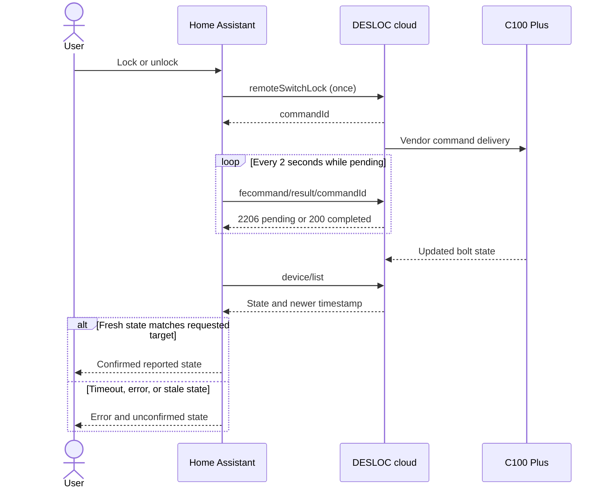
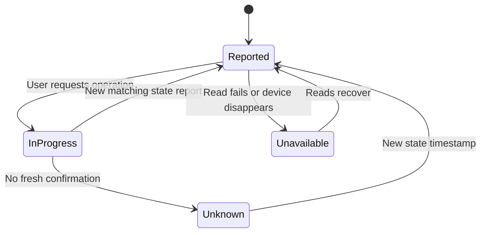

# Observed protocol

Observed on C100 Plus and DESLOC iOS 1.2.1. Examples use synthetic IDs. This is
not an official API specification.

## Authentication

The business API `https://appadmin.desloc.com` requires `authorization`,
`deviceid`, `appversion`, and `systype` headers. Removing any one caused rejection.
The opaque authorization token is sent verbatim.

The app checks `POST /api/user/login/isNeedCaptcha` with `userName` first.
If `data.isNeedCaptcha` is true, the integration stops and asks the user to
complete the challenge in the official app.

The password transformation was recovered from DESLOC Android 1.2.0 and matched
to the iOS 1.2.1 login capture, including its millisecond timestamp:

1. Compute lowercase hexadecimal SHA-256 of UTF-8 `password + DEqFDHCkeOMGEZAq`.
2. Append the current Unix timestamp in milliseconds as decimal text.
3. Encode as UTF-8 and apply AES-256-CBC with PKCS#7 padding, a zero IV, and the
   UTF-8 bytes of `2897ab5600b54465b5ea0a89d9a192c7` as the key.
4. Send the ciphertext as lowercase hexadecimal in `password` to
   `POST /api/user/login`, alongside `userName` and `childAgreement: true`.

These constants provide vendor wire compatibility; they are not protection for
stored credentials. The request still uses verified HTTPS without redirects.
The digest is held only during interactive setup. HA saves the resulting session
token and installation ID, not the password or digest.

Business status `1103` means a new installation requires email verification.
The app sends `POST /api/user/login/sendCode` with `userName`. A successful send
returns `data.flag: 1`, with an interval/expiry. It then submits the login request
with the **unencrypted digest** in `password` and the email verification `code`.
The one-time code is not retained. Other observed/source-derived login statuses:

- `1101`, `1102`, `1106`: account rejection or failed-attempt protection.
- `1105`: invalid verification code.
- `1109`: client time is not synchronized.

Successful login returns `data.accessToken`, `data.expireIn`, and `data.userId`.
The access token matched the subsequent business API authorization. Reported
`expireIn` was `5184000`; actual expiry behavior has not been independently
measured. The integration does not assume a lifetime and does not automatically
sign in after rejection. An authentication error requires interactive reauth;
neither reads nor physical commands are retried after a rejected session.

`POST /api/user/logout` was observed to revoke the captured session used by HA.
Captured-session reauthentication restored reads without changing the lock's
identity. A full login replay using the original installation also succeeded;
a fresh installation requested email verification. Stale password ciphertext
can produce the clock error, so the client creates a new timestamp each time.

```mermaid
sequenceDiagram
    actor User
    participant HA as Home Assistant
    participant Cloud as DESLOC business API
    User->>HA: Email and password
    HA->>HA: Derive temporary password digest
    HA->>Cloud: Check CAPTCHA requirement
    HA->>Cloud: Login with digest and current time encrypted
    alt New installation requires verification
        Cloud-->>HA: 1103
        HA->>Cloud: Send email code
        User->>HA: Enter email code
        HA->>Cloud: Login with digest and one-time code
    end
    Cloud-->>HA: Access token
    HA->>HA: Save token and installation ID, discard digest
    HA->>Cloud: Fetch devices
    HA->>HA: Add all returned locks by stable MAC identity
    Note over HA,Cloud: Reuse token after restart; stop on rejection, without background login
```

Password and email-code login succeeded on a real account. However, the 0.2.0
renewal implementation conflicted with subsequent app logins: the app entered
successfully, then its requests returned 401 after HA signed in again. A distinct
installation ID did not prevent this. The app stayed signed in when HA was
disabled. The server's precise session-scope rules remain undocumented.

Version 0.2.1 removes background login and reuses the saved token on reload.
Importing the app's current session lets HA use that same session without a
competing login. App logout or a later login can revoke it. Legacy 0.2.0 account
entries require interactive reauthentication, avoiding a surprise login during
upgrade. Tests cover no login on rejection/reload and no retry of physical
commands. Natural token expiry remains unobserved.

The app separately posts to `https://iot.desloc.com/oauth/token` with a URL-encoded
form containing `appId` and `biz_token`. That returns an access token, refresh
token, and expiry. Neither the access token nor the form's business token matched
the business API authorization in the captured session. This exchange does not
establish a refresh mechanism for this integration.

Signed requests to `xsgateway.desloc.com` were also observed; this integration
does not require that interface or reproduce its signatures.

## Status

`POST /api/device/list` uses `{"groupId":0,"size":20}`. Success has `status: 200`,
`success: true`, and a device list in `data`. Fields used:

- `id`: numeric cloud identity; commands send its string representation.
- `mac`: Bluetooth MAC, used for stable config-entry identity.
- `deviceName`, `model`, `firmwareVersion`: metadata.
- `doorState`: 1 unlocked, 2 locked; other values remain unknown.
- `doorStateUpdateTime`: reported state timestamp in milliseconds.
- `batteryValue`: percentage, accepted only within 0–100.
- `networkSignal`: RSSI in dBm.
- `onlineStatus`: unverified enum, exposed only as a raw diagnostic.
- `sortFlag`: nullable integer cursor used by the vendor's device-list request.

The Android request model has `groupId`, `size`, and `sortFlag`; its device
manager replaces the cached list for a null cursor and appends for a non-null
cursor. A read-only probe on the current account fetched one row with `size: 1`
and then an empty page using that row's `sortFlag`. This establishes cursor
acceptance/exclusion at the observed boundary; multiple populated pages remain
covered by synthetic tests rather than a large real account.

The client requests the next page when a page is full, using its final row's
integer `sortFlag`, and stops on a short/empty page. It deduplicates MACs and
rejects missing/repeated cursors or more than 100 full pages instead of silently
returning a partial result. Group `0` is the app's default; enumeration across
separate groups/homes remains unverified.

Setup creates a separate HA entry for every returned lock, regardless of model
name. Interactive reconfiguration refreshes matching sessions and adds new
locks without changing existing entity IDs or enabling disabled entries. Normal
polling only updates already configured locks. Account discovery never sends a
lock or PIN command. Other models reuse the C100 Plus protocol experimentally;
the `model_validation` attribute and diagnostics make that scope visible.

Authentication failure can arrive as HTTP 200 with business `status: 401` and
`success: false`. HTTP success alone is insufficient.

## Commands

`POST /api/device/remoteSwitchLock` uses
`{"deviceId":"123","unlock":true}` to unlock, or `false` to lock. Success
returns `data.commandId`, which acknowledges acceptance rather than bolt state.

`POST /api/device/fecommand/result/<commandId>` with `{}` reads progress:

- 2206 with `success: false`: pending.
- 200 with `success: true`: completed according to the cloud.
- 2104: expired or timed-out result.
- Other failures end the operation; authentication errors require reauth.



The total deadline is 45 seconds. After acknowledgement, up to six status reads
allow for delayed telemetry. Physical commands are never automatically resubmitted;
concurrent commands for one entry are rejected.



Redirects are refused, keeping credentials on the fixed HTTPS origin. Errors
omit raw response bodies and credentials. Unknown values are not guessed.
