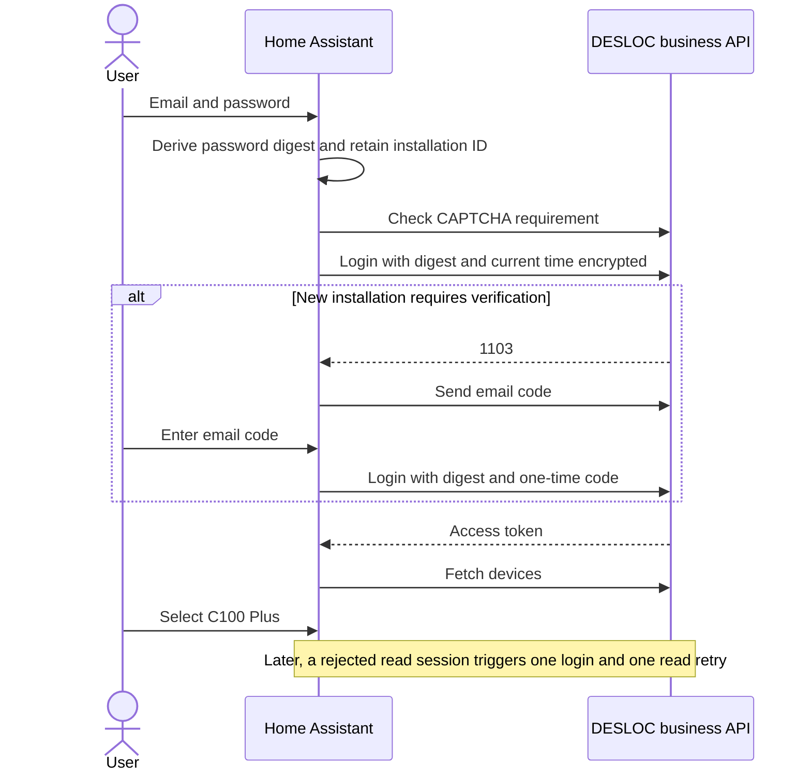
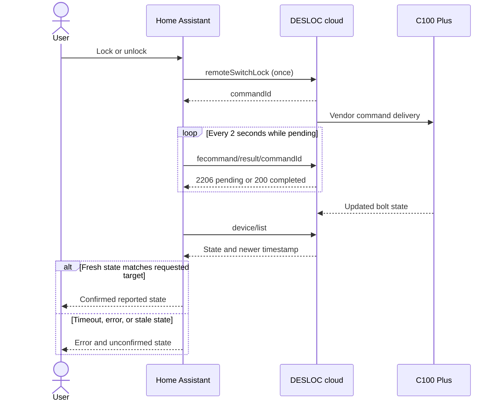
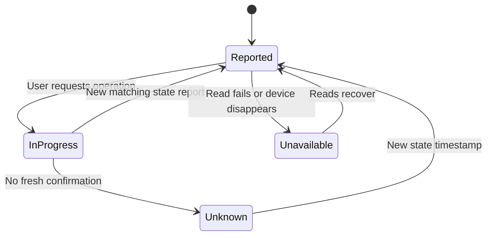

# Observed protocol

Observed on C100 Plus and DESLOC iOS 1.2.1. Examples use synthetic IDs. This is
not an official API specification.

## Authentication

The business API `https://appadmin.desloc.com` requires `authorization`,
`deviceid`, `appversion`, and `systype` headers. Removing any one caused rejection.
The opaque authorization token is sent verbatim.

The app checks `POST /api/user/login/isNeedCaptcha` with `userName` first.
If `data.isNeedCaptcha` is true, the integration stops and asks the user to
complete the challenge in the official app.

The password transformation was recovered from DESLOC Android 1.2.0 and matched
to the iOS 1.2.1 login capture, including its millisecond timestamp:

1. Compute lowercase hexadecimal SHA-256 of UTF-8 `password + DEqFDHCkeOMGEZAq`.
2. Append the current Unix timestamp in milliseconds as decimal text.
3. Encode as UTF-8 and apply AES-256-CBC with PKCS#7 padding, a zero IV, and the
   UTF-8 bytes of `2897ab5600b54465b5ea0a89d9a192c7` as the key.
4. Send the ciphertext as lowercase hexadecimal in `password` to
   `POST /api/user/login`, alongside `userName` and `childAgreement: true`.

These constants provide vendor wire compatibility; they are not protection for
stored credentials. The request still uses verified HTTPS without redirects.
HA retains the derived digest as a password-equivalent secret.

Business status `1103` means a new installation requires email verification.
The app sends `POST /api/user/login/sendCode` with `userName`. A successful send
returns `data.flag: 1`, with an interval/expiry. It then submits the login request
with the **unencrypted digest** in `password` and the email verification `code`.
The one-time code is not retained. Other observed/source-derived login statuses:

- `1101`, `1102`, `1106`: account rejection or failed-attempt protection.
- `1105`: invalid verification code.
- `1109`: client time is not synchronized.

Successful login returns `data.accessToken`, `data.expireIn`, and `data.userId`.
The access token matched the subsequent business API authorization. Reported
`expireIn` was `5184000`; actual expiry behavior has not been independently
measured. The integration renews a rejected session on demand rather than
assuming a lifetime. A lock command rejected during renewal is not replayed.

`POST /api/user/logout` was observed to revoke the captured session used by HA.
Captured-session reauthentication restored reads without changing the lock's
identity. A full login replay using the original installation also succeeded;
a fresh installation requested email verification. Stale password ciphertext
can produce the clock error, so the client creates a new timestamp each time.

The 0.2 beta's email-code completion and independent-installation renewal still
require end-to-end validation. Synthetic tests cover the implementation but do
not substitute for that check.

The app separately posts to `https://iot.desloc.com/oauth/token` with a URL-encoded
form containing `appId` and `biz_token`. That returns an access token, refresh
token, and expiry. Neither the access token nor the form's business token matched
the business API authorization in the captured session. This exchange does not
establish a refresh mechanism for this integration.

Signed requests to `xsgateway.desloc.com` were also observed; this integration
does not require that interface or reproduce its signatures.

## Status

`POST /api/device/list` uses `{"groupId":0,"size":20}`. Success has `status: 200`,
`success: true`, and a device list in `data`. Fields used:

- `id`: numeric cloud identity; commands send its string representation.
- `mac`: Bluetooth MAC, used for stable config-entry identity.
- `deviceName`, `model`, `firmwareVersion`: metadata.
- `doorState`: 1 unlocked, 2 locked; other values remain unknown.
- `doorStateUpdateTime`: reported state timestamp in milliseconds.
- `batteryValue`: percentage, accepted only within 0–100.
- `networkSignal`: RSSI in dBm.
- `onlineStatus`: unverified enum, exposed only as a raw diagnostic.

Authentication failure can arrive as HTTP 200 with business `status: 401` and
`success: false`. HTTP success alone is insufficient.

## Commands

`POST /api/device/remoteSwitchLock` uses
`{"deviceId":"123","unlock":true}` to unlock, or `false` to lock. Success
returns `data.commandId`, which acknowledges acceptance rather than bolt state.

`POST /api/device/fecommand/result/<commandId>` with `{}` reads progress:

- 2206 with `success: false`: pending.
- 200 with `success: true`: completed according to the cloud.
- 2104: expired or timed-out result.
- Other failures end the operation; authentication errors require reauth.

The total deadline is 45 seconds. After acknowledgement, up to six status reads
allow for delayed telemetry. Physical commands are never automatically resubmitted;
concurrent commands for one entry are rejected.

Redirects are refused, keeping credentials on the fixed HTTPS origin. Errors
omit raw response bodies and credentials. Unknown values are not guessed.
