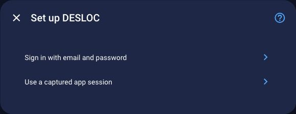
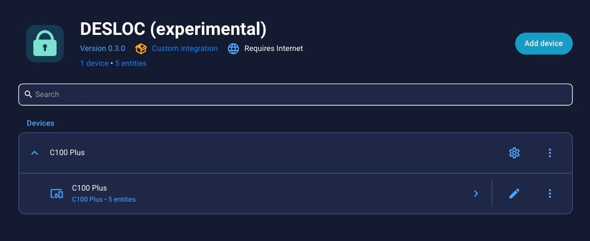
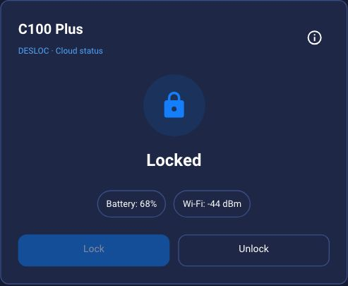
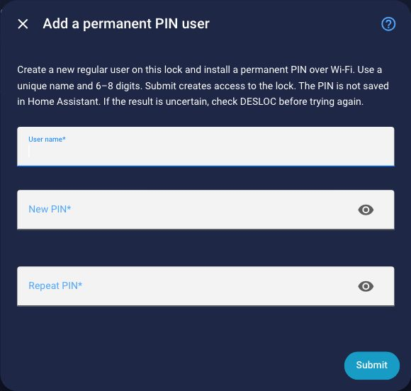

# Screenshot walkthrough

These are cropped screenshots of the installed integration **0.3.0** and
companion card **0.1.1** in **Home Assistant 2026.9.1**, captured on
October 1, 2026. Appearance follows the active Home Assistant theme. They show
one C100 Plus; other models remain experimental. Account details, server
addresses, and private device identifiers are outside the captured regions.

No lock/unlock command or PIN creation was submitted while taking these images.
The displayed state and sensor readings are snapshots of cloud reports, not a
live feed or proof that a door is closed.

## 1. Choose how to authenticate

After [installation](../README.md#installation), open **Settings → Devices &
services → Add integration → DESLOC**. Choose an existing app session or an
interactive email/password login. The latter may also request an email code and
can invalidate the phone app's session. See the
[authentication guide](authentication.md) before choosing.

## 2. Find the discovered locks

Every lock returned by the account during setup or reconfiguration is added
automatically. This example account returned one C100 Plus with five entities,
including diagnostics that are disabled by default. Additional models are added
for community testing; discovery does not establish full compatibility.

## 3. Add the optional dashboard card

Install the separate [DESLOC Lock Card](https://github.com/ha-homelab/ha-desloc-card)
and select the lock and optional battery/Wi-Fi entities in its visual editor.
Unlocking requires confirmation. Both repositories currently use the HACS custom
repository installation path; they are not yet included in the default catalog.

The card shows the reported bolt state. It is not a door-open sensor, and the
cloud may return cached telemetry.

## 4. Create a permanent PIN user

Open **Settings → Devices & services → DESLOC → Configure** for the intended
lock. The empty form below asks for a unique user name and a matching 6–8 digit
PIN. **Submit creates permanent access to that lock**; viewing the form alone
does not. Follow the [PIN user guide](pin-users.md) for completion checks and
failure handling. This workflow is physically tested on C100 Plus.

## Updating these screenshots

Capture only the relevant card or dialog. Keep account names, tokens, PINs,
server URLs, device identifiers, unrelated dashboards, and browser chrome out of
public images. Review every image before committing it, and record the installed
versions and capture date here. Do not operate a physical lock solely to produce
a different screenshot state.
